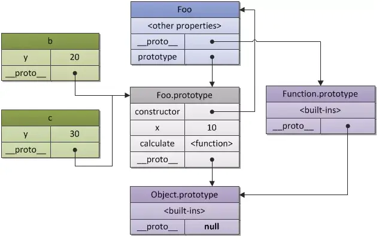
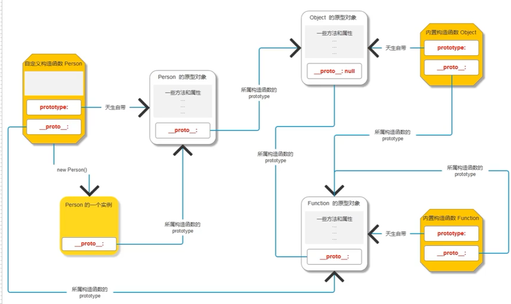

# 面向对象

面向过程：开发中，要考虑顺序，步骤，细节，关注过程 开发方式。所有事都是自己做。
面向对象：对象帮我们完成任务，面向对象的开发方式。
面向对象的核心：高内聚低耦合（对面向过程的高度封装）

构造函数可以批量生产（有属性有方法合理的）对象，每个对象有自己的属性和方法，每个对象可能类似，但内容不同。

## 创建对象的方式

```javascript
// 前两种方法不擅于批量创建。
1.字面量方式  // 可以后期动态添加属性
var obj={
    name: 'lyq',
    age: 18,
    sayHi: function() {
         console.log('hello');
        }
}

2.内置构造函数  // 可以后期动态添加属性
var obj=new Object();
obj.name='lyq';
obj.age=18;
obj.sayHi=function(){ console.log('hello');}

3.工厂函数
//创建工厂函数
function createObj(name,age){
    var obj={};  //手动创建对象
    obj.name=name;   //手动添加属性
    obj.age=age;
    obj.sayHi=function(){
        console.log('hello');
    }
    return obj;   //手动返回对象
}
//使用工厂函数批量创建对象
var obj1=createObj('lyq',18);
var obj2=createObj('jack',20);

4.自定义构造函数  （推荐）
// 创建自定义构造函数，自动创建对象并返回，只需手动添加属性
function createObj(){
    this.name=name;  // this指向当前实例obj1，函数内代码执行时，就是向obj1添加这些成员
    this.age=age;
    this.sayHi=function(){
        console.log('hello');
    }
}
// 使用自定义构造函数创建对象，要和new关键字连用，函数里的this指向当前实例
var obj1 = new createObj('lyq',18);
var obj2 = new createObj('wtw',22);
```

### 构造函数的使用

构造函数和普通函数没区别，只不过在调用的时候和new关键字连用，才会有自动创建和返回对象的能力。
函数名与new连用时，函数内部的this指向当前实例。
构造函数内不要随便写return。return基本类型，没有意义；return复杂类型，构造函数白写。

* 构造函数的不合理：
在函数内写方法，需要用对象调用方法时（给对象添加方法），只要创建new一次对象就会有一个函数占用空间。 => 对象越多，产生更多重复函数，浪费空间。

## 原型 prototype

原型解决问题：需要给实例对象添加方法时，直接书写在构造函数体内，这个行为并不好。
每次创建实例时，都会创建一个函数数据类型，多个函数方法一模一样，却占据多份内存空间。

--原型--
构造函数的每一个实例都可以使用原型上的方法，而且使用的都是同一个函数，不会浪费空间。
构造函数的属性写在函数体内；方法写在函数原型上。
1 prototype
每个函数自带一个属性prototype 原型对象，可以使用对象操作的语法，向里面添加成员。
2__proto__
每个实例对象自带一个属性__proto__  隐式原型，指向所属构造函数的prototype
// 实例对象p1._proto__=== Person.prototype
3 constructor
每个prototype原型都有一个constructor属性，指向它关联的构造函数
4 原型链
获取对象属性时，如果对象本身没有这个属性，那就会去他的原型__proto__上去找，如果还查不到，就去找原型的原型，一直找到最顶层(Object.prototype)为止。Object.prototype对象也有__proto__属性值为null。

注意：Object是属于原型链的顶层，所有构造函数的prototype都指向Object.prototype



```javascript
function Person(){
    Person.prototype.sayHi=function(){ console.log('hello')};
}
var p1 = new Person();
p1.sayHi;  //p1使用的sayHi方法是Person构造函数的原型上的方法
var p2 = new Person();
p2.sayHi;
```

* 问题：
1.实例对象p1上的 __proto__指向 => Person.prototype
2.Person.prototype的 __proto__指向 => object.prototype   //Person.prototype是对象数据类型object，js内所有object类型属于object这个内置构造函数。
3.Person的 __proto__指向 => Function.prototype  //Person是一个函数，函数本身也是对象，有__proto__。js内，所有函数属于内置构造函数Function的实例。
4.Object.prototype的 __proto__指向 => null   //Object.prototype是一个对象数据类型，只要是对象，都属于object这个内置构造函数。object.prototype在js内是顶级原型，不再有prototype
5.Object的 __proto__指向 => Function.prototype   //object是个内置构造函数，也是个函数、对象，js内，所有函数属于内置构造函数Function的实例。
6.Function.prototype的 __proto__指向 => Object.prototype  //Function.prototype是一个对象数据类型，只要是对象数据类型都是object的实例。
7.Function的 __proto__指向 => Function  //Function是个内置构造函数，也是个函数，js内，所有函数属于内置构造函数Function的实例。Function是自己的构造函数，也是自己的实例对象。



原型链：用__proto__串联起来的对象链状结构
每个对象数据类型，都有一个属于自己的原型链
作用：为了访问对象成员
