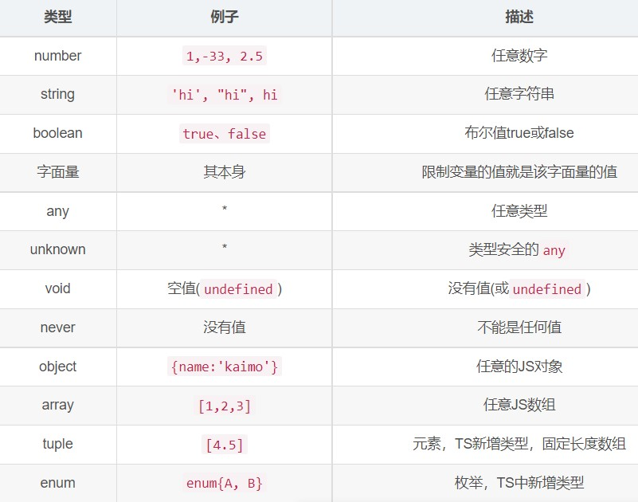

# TypeScript

## 简介

以js为基础构建的javaScript的超集语言。
TS---编译--->JS    // TS不能被js解析器直接执行，TS扩展了js并添加了类型
TS增加了：类型、支持ES的新特性、ES不支持的新特性、配置选项、开发工具
使用： tsc  1.hello.ts   //执行后，同级目录下会编译出一个同名.js文件

## 类型声明

类型声明给变量设置了类型，使得变量只能储存某种类型的值。
let a: number;
a = 10;
let b: string = 'hello';
function add(c: number, d: number): number{
    return c+d;
}
自动类型判断：TS有自动的类型判断机制，同时声明并赋值，TS编译器自动判断变量类型（可以省略掉类型声明）。let b = 'hello';

## 类型



* 字面量： 直接用字面量进行类型声明
let a: 10;
a = 10;
a = 11;  //不能把类型“11”分配给类型“10”
<!-- 联合类型 -->
let b: boolean | string;
b = true;
b = 'hello';

* any：变量设置any后，相当于关闭变量的类型检测（不建议）
let d: any;
let d;     //不指定类型时，ts解析器自动判断类型为any(隐式)

* unkonwn：未知类型的值，实际上就是类型安全的any
let e: unkonwn;
e = 'hello';
let s: string;
s = e;  // unknown类型的变量，不能直接赋值给其它变量
可以先类型判断再赋值
if(typeof e === "string"){
    s = e;
}
或 类型断言，告诉解析器变量的实际类型
`s = e as string;`
`s = <string>e;`

* void：空
// 表示没有返回值的函数
function fn(): void{
    return "";
}
* never：永远不会返回结果
function fn2(): never{
    return ...   //不能把类型...分配给类型“never”
    throw new Error('报错');
}

* object：js对象

```ts
let a: object;
a = {};
a = funciton(){
};
// ? 表示可选 
// [propName: string]: any 表示任意类型的属性
let b: {name: string, age?: number, [propName: string]: any};
b = {
    name:'lyq',
    age:22,
    gender:'女'
};
// 函数结构类型声明   => 返回值
let d: (a: number,b:number) => number;
d = function(n1: number,n2: number): number{
    return n1+n2;
}
```

* array：

```ts
// 类型[] 或  Array<number>
let e: string[];
e=['a','b'];
let f: number[];
let g: Array<number>;
g=[1,2,3];
```

* tuple元组：固定长度的数组
let h: [string,number];
h = ['hello',123];

* enum枚举：一组命名常量
enum Gender{
    Male = 0,
    Female = 1
}
let i: {name:string,gender:Gender}
i = {
    name:'lyq',
    gender: Gender.Female
}

## 编译选项

* 自动编译文件-w：ts编译器会自动监视文件的变化，变化时重新编译
tsc hello.ts  -w
* 自动编译整个项目tsc：将当前项目下所有ts文件编译为js
前提：先在项目根目录下创建配置文件tsconfig.json
* 配置tsconfig.json

```json
{
"include": ["./src/**/*"], //希望被编译文件所在的目录
    "exclude": ["./demo/**/*"],  //需要排除在外的目录
    "compilerOptions": {
        "target": "es2015", //指定ts被编译为的ES的版本
        "module": "es2015",  //指定要使用的模块化的规范
        // "lib": ["DOM"],    //指定项目中要使用的库
        "outDir": "./dist",  // 指定编译后文件所在的目录
        // "outFile": "./dist/app.js" // 仅支持 "amd" 和 "system" 模块。
        // 是否对 js 文件进行编译，默认是false
        "allowJs": true,
        // 是否检查js代码是否符合语法规范，默认false
        "checkJs": true,
        // 是否移除注释
        "removeComments": true,
        // 不生成编译后的文件
        "noEmit": false,
        // 当有错误时不生成编译后的文件
        "noEmitOnError": true,
        // 所有严格检查的总开关
        "strict": true,
        // 用来设置编译后的文件是否使用严格模式，默认false
        "alwaysStrict": true,
        // 不允许隐式的any类型
        "noImplicitAny": true,
        // 不允许不明确类型的this
        "noImplicitThis": true,
        // 严格的检查空值
        "strictNullChecks": true
    }
}
```

## webpack打包ts

<https://blog.csdn.net/kaimo313/article/details/127139394>

## 面向对象

程序中的所有操作都需要通过对象来完成。
操作浏览器->window对象，网页->document对象，控制台->console对象。

## 类

创建对象要先定义类，根据类创建指定类型的对象。

* 定义类、使用类

```ts
class Person{
    name: string;
    age: number;
    constructor(name: string,age: number){
        this.name = name;   //this表示当前实例
        this.age = age;
    }
    sayHello(){
        console.log(`hello,i am ${this.name}`); //通过this表示当前方法的对象
    }
}
const p = new Person('lyq',22);
p.sayHello();
```

## 继承

继承后，子类拥有父类所有属性和方法。
重写：子类添加与父类相同的方法，子类方法会覆盖掉父类的方法。

## super关键字

类的方法中，super表示当前类的父类。
如果子类中写了构造函数，必须对父类的构造函数进行调用。

## 抽象类

以abstract开头的类，没有方法体，专门用来被继承，不能用来创建对象。
抽象方法只能定义在抽象类中，子类必须对抽象方法进行重写。

## 接口

定义一个类结构，定义类中应该包含哪些属性和方法，可以当作类型声明使用。
接口中所有属性不能有实际的值，所有方法都是抽象方法，只定义对象的结构。

## 属性封装

public
protected
private

## 泛型

定义函数或类时，如果遇到类型不明确就可以用泛型

```ts
function fn<T>(a:T):T{
    return a;
}
// 可以直接调用具有泛型的函数
// 不指定泛型，ts自动推断类型
let res = fn(22);
// 指定泛型
let res2 = fn<string>("hello");
// 指定多个泛型
function fn3<T，K>(a:T, b:K):T{
    return a;
}
let res3 = fn<number,string>(123, "hello");
// <T extends inter>   必须实现inter类
// 给类添加泛型
class MyClass<T>{
    name: T;
    constructor(name: T) {
        this.name = name;
    }
}
const mc = new MyClass<string>("lyq");
```
