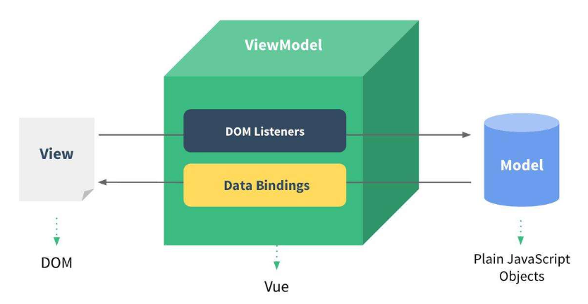
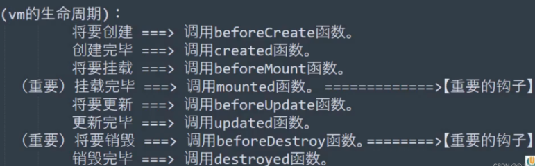

# Vue 核心

* MVVM模型
M：模型model，data中的数据
V：视图view，模板
VM：视图模型viewModel，vue实例对象



VM：就是vue实例本身，双向绑定了V和M。将view绑定到model上，view变化，对应model也变化。将model单向绑定到view上，{{}}或v-bind都可以。

* 面试：虚拟DOM
虚拟DOM就是内存中的数据，然后将虚拟DOM转变成真实DOM
好处：将虚拟DOM和真实DOM比较（diff算法），发现001，002，003是重复的。于是就不会再次渲染001，002，003. 而是复用它们。只有004的虚拟DOM是不重复的，需要重新渲染，提高了展示效率。
虚拟DOM的比较算法，是基于key进行比较，在进行渲染时，会将内存中的老虚拟DOM和新虚拟DOM根据key做比较，一旦发现虚拟DOM之间有变化，那么只重新渲染变化部分，复用未变化部分。
一旦结构中包含输入类DOM，会产生错误DOM更新，导致界面渲染有问题。

* 面试总结：react、vue中的key有什么作用？（key的内部原理）
1 虚拟DOM中key的作用：key是虚拟DOM中对象的标识，当数据发生变化时，Vue会根据【新数据】生成【新的虚拟DOM】，随后Vue进行【新虚拟DOM】与【旧虚拟DOM】的差异比较，比较规则如下：

2 对比规则：
旧虚拟DOM中找到了与新虚拟DOM相同的key：
    若虚拟DOM中内容没变, 直接使用之前的真实DOM
    若虚拟DOM中内容变了, 则生成新的真实DOM，随后替换掉页面中之前的真实DOM
旧虚拟DOM中未找到与新虚拟DOM相同的key：创建新的真实DOM，随后渲染到页面

3 用index作为key可能会引发的问题：
若对数据进行逆序添加删除等破坏顺序操作：会产生没有必要的真实DOM更新 ==> 界面效果没问题, 但效率低
若结构中还包含输入类的DOM：会产生错误DOM更新 ==> 界面有问题

4 开发中如何选择key?
最好使用每条数据的唯一标识作为key，比如id、手机号、身份证号、学号等唯一值。
如果不存在对数据的逆序添加、逆序删除等破坏顺序的操作，仅用于渲染列表，使用index作为key是没有问题的。

## 简介

动态构建用户界面的渐进式js框架。

* 特点：遵循MVVM模式；编码简洁，体积小，运行流畅；本身只关注UI，可引入其它三方库开发项目。
借鉴Angular的模板和数据绑定技术；借鉴React的组件化和虚拟DOM技术。

* 周边库：
    vue-cli      //vue脚手架
    vue-resource
    axios
    vue-router   //路由
    vuex         //状态管理
    element-ui   //基于vue的UI组件库（PC端）

## 创建vue对象，vue插值语法

```html
<!-- 容器 -->
<div id="root">
    <!-- 内部代码：vue模板 -->
    <h1>hello,{{name}}</h1>
</div>
<script>
    // 阻止vue启动时的生产提示
    Vue.config.production = false;
    // 创建vue实例，构造方法 传参（配置对象，只对当前绑定容器生效）
    new Vue({
        el:'#root',  //el 指定当前vue实例为哪个容器服务，值为css选择器字符串
        data:{  //data 存储数据，供el指定的容器使用
            name:'jojo'
        }
    })
</script>
```

一个vue实例只能绑定一个对应实例，一对一关系。
{{ js表达式 }}
<!-- js表达式：a  a+b  demo(1)   x === y ? 'a' : 'b' 等 -->

### el和data两种写法

```js
// el绑定容器的两种写法
const vm = new Vue({
    // el: '#root'   // 第一种
    data:{
        name:'jojo'
    }
})
vm.$mount('#root')   // 第二种， 原理：调用了原型链上的$mount属性
// data两种写法
const vm = new Vue({
    el: '#root',
    data: {  // 第一种，对象式
        name:'jojo'
    }
    data () {  // 第二种，函数式 -> 组件开发全是函数式，返回一个对象
// vue管理的函数只能写成普通函数，如果写箭头函数，this会是window
        return {
            name:'jojo'
        }
    }
})
```

## 模板语法-指令语法

插值语法：解析标签体内容，{{js表达式}}
指令语法：解析标签，v-bind:href="js表达式"

```html
<div id="root">
    <!-- 插值语法：用于标签体 -->
    <h1>hello, {{name}}</h1>
    <!-- 指令语法：直接绑定在标签的自定义属性上 -->
    <a v-bind:href="url.toUpperCase()">链接</a>
    <a :href="url">链接</a>
</div>
<script>
    new Vue({
        el:'#root', 
        data:{ 
            name:'jojo',
            url:'http://www.bilibili.com/'
        }
    })
</script>
```

### 数据绑定

* 单向数据绑定 v-bind   // 数据只能从data流向页面
     `<input type="text" v-bind:value="name">`
     `<input type="text" :value="name">`
* 双向数据绑定 v-model  // 数据从data流向页面，从页面流向data
     `<input type="text" v-model:value="name">`
     `<input type="text" v-model="name">`
// v-model:value 简写是 v-model ，因为v-model只能应用在表单类（输入类元素）上

## Object.defineProperty方法

给对象添加属性，可以配置很多详细信息

```js
let num = 18
let person = {
    name: 'lyq',
    sex: '女',
    age: num
}
// 为person对象添加age属性，参数（要更改的对象，要添加的属性，配置对象）
Object.defineProperty(person, "age", {
    // value: 18,      // 设置age属性值18
    writable: false // 默认，不可被修改
    configurable: false // 默认，不可被删除
    enumerable: false  // 默认，不可枚举，不能for-each循环遍历对象属性了
    get(){
        return num
    }
    set(value){
        num = value
    }
})
```

## vue数据代理(劫持)

通过vm对象代理data对象中属性的操作（读/写）
好处：方便操作data中的数据
基本原理：
    通过object.defineProperty()把data对象中的所有属性添到vm上，
    并给每个属性指定getter/setter，在getter/setter内部操作data对应的属性。

vue将vm._data的name和address，映射到vm.name和vm.address上，vm._data.name改变，am.name也改变。
通过数据代理，我们本应该操作 vm._data.属性 ，现在直接操作 vm.属性 即可

## 事件处理 & methods

绑定事件：v-on:xxx 或 @xxx
事件回调要配置在methods对象上
@click="demo" 和 @click="demo($event)"
// 效果一致，后者可传参，传实参event对象，要写成$event （实参占位符）
event是一个内置全局对象，event.preventDefault() 阻止默认事件发生

```html
<div id="root">
    <h2>hello,{{name}}</h2>
    <button v-on:click="showInfo1">按钮</button>
    <button @click="showInfo2($event, 66)">按钮</button>
</div>
<script>
    new Vue({
        el: '#root',
        data: {
            name:'jojo'
        },
        methods: {  // methods中的函数都被vue管理，this指向vm或组件实例对象
            showInfo1(event){
                console.log(event)
                console.log(this.name) // 直接用this调用data配置属性
            },
            showInfo2(event, num){  // 通过占位符，同时获取event和另一个实参
                console.log(event, num)
            }
        }
    })
</script>
```

* 事件修饰符    // 可以连续写 @click.prevent.stop=""
    prevent 阻止默认事件
    stop    阻止事件冒泡到上层
    once    事件只触发一次
    capture 事件捕获模式
    self    只有event.target是当前操作的元素才触发
    passive 事件默认行为立即执行，无序等回调执行完
* 键盘事件
`<input type="text" @keydown.enter="showInfo">`  // 此处不可写()
按键别名：
    回车：enter
    删除：delete (捕获“删除”和“退格”键)
    退出：esc
    空格：space
    换行：tab (特殊，必须配合keydown去使用)
    上：up  下：down  左：left  右：right
系统修饰键：ctrl shift alt meta
    配合keyup：按下修饰键的同时，按下并释放其它键，事件触发
    配合keydown：正常触发事件
自定义按键别名 Vue.config.keyCodes.自定义键名 = 键码

## 计算属性 computed

解决的问题：插值语法中，js表达式长，不利于阅读和组件化。
定义：要用的属性不存在，需要通过已有属性计算。
原理：底层借助object.defineproperty()提供的getter和setter。
优势：与methods实现相比，内部有缓存机制（复用），效率高，调试方便。
计算属性最终在vm上，修改要用set函数，set中要引起计算时依赖的数据改变。

```html
<div id="root">
    姓：<input type="text" v-model="firstName"><br>
    名：<input type="text" v-model="lastName"><br>
    姓名：<span>{{fullName}}</span>      // 张-三
</div>
<script>
    new Vue({
        el:'#root',
        data:{
            firstName:'张'，
            lastName:'三'
        },
        computed:{
            fullName:{
                get(){    //初始读取执行一次，依赖的数据变化时会再次调用
                    return this.firstName +'-'+ this.lastName;
                },
                set(value){
                    const arr = value.split('-');
                    this.firstName = arr[0];
                    this.lastName = arr[1];
                }
            }
            //计算属性只读不改->简写
            // fullName(){
            //     return this.firstName +'-'+ this.lastName;
            // }
        }
    })
</script>
```

## 监视属性 watch

当被监视的属性变化，回调函数自动调用
监视的属性必须存在，才能监视
当data中某字段发生变化，就调用handler函数（newValue, oldValue）
写法：创建vue时传入watch配置；通过vm.$watch监视。

```js
new Vue({
    el: '#root',
    data: {
        isHot: true
    }
    // 方法1
    watch:{
        isHot:{
            immediate: true, //初始化时让handler调用
            handler(newValue,oldValue){   //isHot发生改变时，handler被调用
                console.log('isHot被修改了',newValue,oldValue)
            }
        }
    }
    // 方法2
    // vm.$watch('isHot',{
    //     handler(newValue,oldValue){
    //         console.log('isHot被修改了',newValue,oldValue)
    //     }
    // })
})
```

* 深度监视
watch默认不监测对象内部值的改变（一层）    // vue自身可以监测
配置deep:true可以监测对象内部值的改变（多层）

```html
<h3>a的值：{{numbers.a}}</h3>
<button @click="numbers.a++">+1</button>
<script>
data:{
    numbers:{
        a:1,
        b:1
    }
}
watch:{
    // 监视多级结构中所有属性的变化
    numbers:{
        deep:true,
        handler(){
            console.log('number值改变了')
        }
    }
}
    // 监视多级结构某个属性的变化
    'numbers.a':{
        handler(){}
    }
</script>
```

* 监听属性watch & 计算属性computed
computed可以完成的功能，watch都可以；watch可以异步操作，computed不能。
原则：
    被vue管理的函数，最好写成普通函数，this指向才是vm或组件实例对象
    不被vue管理的函数（定时器回调、ajax回调、promise回调），最好写成箭头函数

## v-bind绑定class/style样式

class样式：
    class="字符串/对象/数组"
    字符串写法：类名不确定，要动态获取
    对象写法：要绑定多个样式，个数不确定，名字也不确定
    数组写法：要绑定多个样式，个数确定，名字也确定，但不确定用不用
style样式：
    :style="{fontSize: xxx}"     //xxx 动态值
    :style="[a,b]"               //a,b 样式对象

```html
<div class="basic" :class="mood" @click="changeMood">{{name}}</div>
<div class="basic" :class="classArr">{{name}}</div>
<div class="basic" :class="classObj">{{name}}</div>

<div class="basic" :style="styleObj">{{name}}</div>
<div class="basic" :style="styleArr">{{name}}</div>
data:{
    name:'尚硅谷'，
    mood:'normal',
    classArr:['a1','a2','a3']
    classObj:{
        atguigu1:false,
        atguigu2:false,
    },
    
    styleObj:{
        fontSize: '40px',
        color:'red',
    },
    styleObj2:{
        backgroundColor:'orange'
    },
    styleArr:[
        {
            fontSize: '40px',
            color:'blue',
        },
        {
            backgroundColor:'gray'
        }
    ]
    },
    methods: {
        changeMood(){
            const arr = ['happy','sad','normal']
            const index = Math.floor(Math.random()*3)
            this.mood = arr[index]
        }
    }
```

## 条件渲染 v-if v-show

v-if （动态控制节点是否存在）适用于切换频率低的场景，不展示的DOM元素直接被移除，结构不能被打断  
    v-if ="表达式"
    v-else-if ="表达式"
    v-else="表达式"
v-show （动态控制节点是否展示）适用于切换频率高的场景，不展示的DOM元素只是样式被隐藏，元素还在
    v-show ="表达式"
<!-- v-if 元素可能无法获取到，v-show一定可以获取到 -->

## 列表渲染

### v-for 展示列表数据

`<li v-for="(item,index) in xxx" :key="yyy">`
// key值可以是index(0,1,2...)或遍历对象的唯一标识
可遍历：数组、对象、字符串、指定次数

```html
<ul>   
    <!-- 遍历数组 -->
    <li v-for="(p,index) in persons" :key="index">
        {{p.name}}-{{p.age}}
    </li>
</ul>
<ul>
    <!-- 遍历对象 -->
    <li v-for="(value, k) of car" :key="k">
        {{k}}-{{value}}
    </li>
</ul>
<script>
new Vue({
    el: '#root',
    data:{
        persons: [
            {id:'1001',name:'张三',age:18},
            {id:'1002',name:'张三三',age:19}
        ],
        car: {
            name: '奥迪A7',
            price: '70w',
            color: 'black'
        }
    }
})
</script>
```

### 列表过滤（模糊搜索）

```html
<input type="text" placeholder="请输入名字" v-model="keyWord">
<ul>
    <li v-for="(p,index) of filPersons" :key="index">
        {{p.name}}-{{p.age}}-{{p.sex}}
    </li>
</ul>
<script>
new Vue({
    el:'#root',
    data:{
        keyWord:'',
        persons:[
            {id:'001',name:'马冬梅',age:19,sex:'女'},
            {id:'002',name:'周杰伦',age:21,sex:'男'},
            {id:'003',name:'温兆伦',age:22,sex:'男'}
        ],
        filPersons: []
    },
    // watch: {
    //     keyWord: {
    //         immediate: true,
    //         handler(val){
    //             this.filPersons = this.persons.filter((p)=>{
    //                 return p.name.indexOf(val) !== -1
    //             })
    //         }
    //     }
    // }
    computed:{
        filPersons(){
            return this.persons.filter((p)=>{
                return p.name.indexOf(this.keyWord) !== -1
            })
        }
    }
})
</script>
```

### vue检测数据改变的原理

* 在vue中修改元素：
数组变更方法 push pop shift unshift splice sort reverse
<!-- eg: this.student.friends.unshift({ name: "jack", age: 70 })  -->
添加一个data没有的属性，且是响应式的：
    Vue.set(this.student,'sex','女')
    vm.$set(this.student,'sex','女')
<!-- 不能给根数据对象添加属性 -->
* vue监视数据的原理：
vue会监视data中所有层次的数据；
通过setter检测对象中的数据，且要在new vue时就传入；
    对象中后追加的属性，vue默认不做响应式处理，除非用Vue.set或vm.$set

## vue收集表单数据

单选框绑定技巧
多选框绑定技巧
下拉框绑定技巧
v-model特殊用法
<!-- 
若: <input type="text"/>，则v-model收集的是value值，用户输入的就是value值。
若: <input type="radio"/>，则v-model收集的是value值，且要给标签配置value值。
若: <input type="checkbox" />
    1.没有配置input的value属性，那么收集的就是checked(勾选 or未勾选，是布尔值)
    2.配置input的value属性:
        (1)v-model的初始值是非数组，那么收集的就是checked(勾选or未勾选，是布尔值)
        (2)v-model的初始值是数组，那么收集的的就是value组成的数组
v-model的三个修饰符:
    lazy:失去焦点再收集数据
    number:输入字符串转为有效的数字
    trim:输入首尾空格过滤 -->

## vue过滤器 |

对要显示的数据进行特定格式化后再显示（简单逻辑处理）。
多个过滤器可以串联，并不会改变原本的数据，产生新的对应的数据。
语法：
    注册过滤器：全局 vue.filter(name,callback) 或 局部 new Vue({filters:{}})
    使用过滤器： {{ xxx | 过滤器名 }} 或 v-bind:属性 = "xxx | 过滤器名"

## vue常用内置指令

* v-text
`<div>{{name}}</div>`
等价于
`<div v-text="name"></div>`
* v-html：可以解析html标签（动态渲染html有风险--xss攻击）
`<div v-html="<h1>hello</h1>"`
* v-cloak
配合css可以解决网速慢时页面展示出{{xxx}}的问题
* v-once
只动态渲染一次（优化性能）
* v-pre
不会被解析（不能乱用，优化性能）

## vue自定义指令

```js
// 例: <span v-big="n"></span>
directives:{
    // 函数式
    big(element,binding){  // 参数1：DOM元素，即span ，参数2：'n'
        element.innerText = binding.value * 10
    }
    // 对象式
    fbind:{
        // 参数 element binding
        // 三种不同时机
        bind(){},
        inserted(){},
        update(){}
    }
}
```

## vue生命周期函数（钩子）

this指向vm


常用：
    mounted：发送Ajax请求，启动定时器，绑定自定义事件，订阅消息（初始化）
    beforeDestroy：清除定时器，解绑自定义事件，取消订阅消息（收尾）
vm.$destroy() 完全销毁一个vue实例
