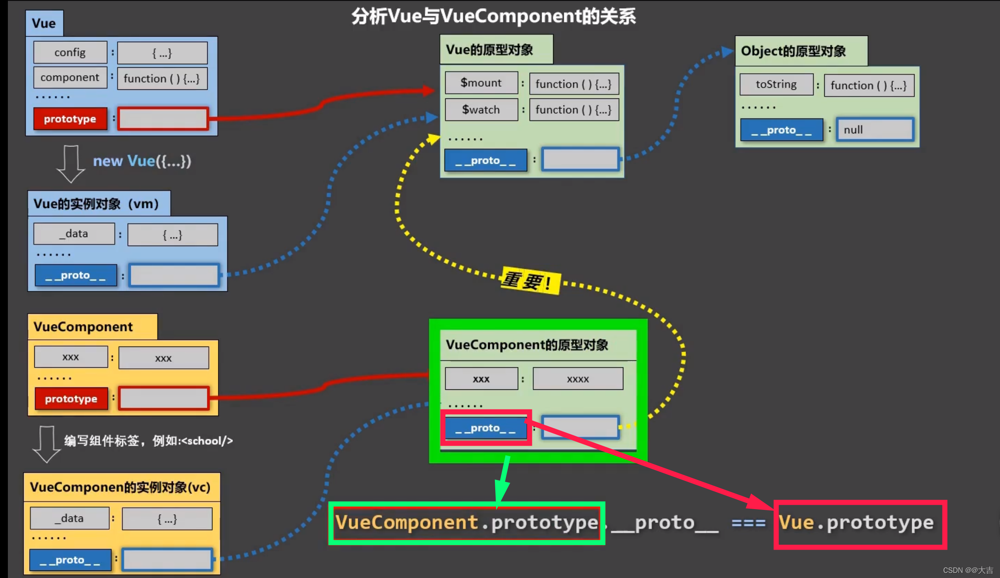

# vue 组件化开发

## 概念

组件：实现应用中局部功能代码和资源的集合

## 非单文件组件

使用Vue.extend创建组件
不要写el配置项，因为组件不用对任何父组件负责，只对vm本身负责；
data必须函数式，保证局部封装性；
template内HTML只能一个根元素；
全局注册 Vue.component('组件名','位置')
局部注册 new Vue时传入components选项

* vueComponent构造函数
是vue.extend生成的，每次调用vue.extend，返回的都是全新的VueComponent

* Vue 和 vm 的关系
Vue是一个函数，vm是其new出来的实例对象，因此:vm.__proto__ === Vue.prototype
VueComponent 是一个函数，VueComponent实例对象是一个对象
当渲染VueComponent时，VueComponent实例对象就被自动new出来了
因此：VueComponent实例对象.___proto___=== VueComponent.prototype.__proto__
VueComponent.prototype.__proto__ === Vue.prototype
所以：VueComponent实例对象.__proto__ === VueComponent.prototype.__proto__ === vm.__proto__ === Vue.prototype

显式原型属性只有函数有，对象没有，对象只有隐式原型属性
所以，函数.prototype 是一个对象。它再往上追溯原型链，就只能找__proto__了
因此VueComponent.prototype.__proto__ === Vue.prototype，对象===对象，这个等式成立。
函数实例的原型属性（函数对象.__proto___）,永远指向自己缔造者（函数）的原型对象(函数.prototype)
原型链的尽头是Object，Object实例的原型属性指向null。

让VueComponent实例对象可以访问到Vue原型的属性和方法。

## 单文件组件

template
script
style
默认方式将组件暴露出去export　default
name字段名必须和文件名一致
入口文件(vm): main.js 引入app.vue管理者组件

## vue-cli

vue官方提供的标准化开发平台

## 其它相关属性

### render函数

render: h => h(App)

### $refs属性

标识：`<h1 ref="title"></h1> 或 <School ref="xxx"></School>`
// 本质上就是加了个id属性
获取：this.$refs.title
ref应用在html标签上获取的是真实dom元素；应用在组件标签上是组件实例对象vc

### props配置项

父子组件间传输数据（父传子）
父：传递数据 `<Student name="lyq" :age=18 sex="女">`
子：props接收参数，相当于在自己的data属性中绑定了props的一些属性

* props三种写法： props字段优先级高于data，同名优先渲染
<!-- props只读，修改会警告，可以复制props的内容到data中一份，去改data中的数据。v-model绑定的值不能是props传过来的值 -->
props: ['name','age','sex']
props: {
  name: String,
  age: Number,
  sex: String
}
props: {
  name: {
    type: String,
    required: true
  },
  age: {
    type: Number,
    default: 22
  }
}

* 子传父：传入函数调用。父亲传给儿子一个函数，儿子用props接收并调用，向函数内传入子数据。
父：`<Son :fatherFunc="myFunc"></Son>`
methods:{
  myFunc(id){
    console.log(id)  // 子数据
  }
}
子：this.fatherFunc(this.sonId)

### mixin混入

解决组件代码重复问题
定义混合：编写mixin.js文件{data(){...},methods:{...}}
使用混合：
    局部引入混合：
      import {hunhe,hunhe2} from './mixin'
      mixins:[hunhe,hunhe2]
    全局引入混合：
      import {hunhe,hunhe2} from './mixin'
      Vue.mixin(hunhe)

### 插件install

定义插件：
对象.install=function(Vue, options){
  Vue.filter(...)  // 全局过滤器
  Vue.directive(...)  // 全局指令
  Vue.mixin(...)  //全局混合
  Vue.prototype.$myMethod = function () {...} // 实例方法
}
// 第一个参数是Vue，之后的参数是插件使用者传递的数据

main.js中全局引用插件：
  import plugins from './plugins'
  Vue.use(plugins)

### scoped CSS样式作用域

解决的问题：两个不同的组件，class重名，类选择器一样，样式不同，如果在app处同时引入这两个组件，会引发样式冲突。
scoped： 使style只对本组件生效

## 浏览器本地存储 localStorage,sessionStorage

* webStorage
存储内容大小一般支持5MB，浏览器端通过Window.sessionStorage和Window.localStorage实现本地存储机制。
相关API：
  xxxStorage.setItem('key','value')
  xxxStorage.getItem('person') // 获取value或null
  xxxStorage.removeItem('key')
  xxxStorage.clear()
就算浏览器关闭，localStorage仍存在，要手动清除才会消失。
sessionStorage仅仅应用于一次会话，存储的内容随着浏览器窗口关闭而消失。
JSON.parse(null)的结果仍是null

## 自定义事件 $emit （子传父）

父组件给子组件绑定自定义事件，就可以不通过props接收子组件的数据。
绑定 this.$emit('', 数据)
解绑 this.$off('')  
解绑多个 this.$off(['','',''])
解绑所有自定义事件 this.$off()

```js
父：两种写法
// <Student @atguigu="getStudentName" />
methods: {
  getStudentName(name,...params){ // 支持多参数接收$emit传来的形参
    this.studentName = name
  }
}
// <Student ref="student" />
mounted () {
  // 参数1：父组件指定名称，参数2：回调，回调要么配置在methods中，要么用箭头函数
  this.$refs.student.on('atguigu', this.getStudentName)
}
子：
methods: {
  sendStudentName(){
    // 触发Student组件实例上的atguigu事件
    // 参数1：父组件指定的名称，参数2-：要传给父组件的形参
    this.$emit('atguigu',this.name,66,77,88,99)
  }
}
```

* native修饰符（绑定原生标签，非自定义标签）
@click.native="xxx" 父组件给子组件绑定原生事件

## 全局事件总线 GlobalEventBus

任意组件间进行通信
bus组件作为所有组件的协调者，必须全局vc可见，放在vm上
在main.js中注册全局事件总线：
new Vue({
  ...
  beforeCreate(){
    Vue.prototype.$bus = this; // $bus就是vm，可以调用$emit等
  }
})

```js
// $on 和 $emit 是一对，参数一致，一个监听一个触发
Student和School是兄弟组件
Student：
methods: {
  sendStudentName(){ //事件触发，立即使用bus总线上的emit方法触发事件发送
    this.$bus.$emit('hello', this.name);
}}
School：
mounted () {
  this.$bus.$on('hello',name => {
    console.log(name) // 兄弟传来的name
  })
},
beforeDestroy() { // 一旦vc被干掉，最好解绑自定义事件
  this.$bus.$off("hello")
}
```

## 消息订阅与发布

借助三方库，实现组件间通信。
npm i pubsub-js
该库常用方法：subscribe订阅、unsubscribe取消订阅、publish发布

```js
sendStudentName(){
  // this.$bus.$emit('hello',this.name)
  pubsub.publish('hello',666)
}

mounted() {
  // this.$bus.$on('hello',name =>{
  // console.log(name)
  // })
  this.pubId = pubsub.subscribe('hello',(msgName,msgData)=>{
    console.log("有人发布了"+msgData)
  })
},
beforeDestroy() {
  //取消订阅
  pubsub.unsubscribe(this.pubId)
  // this.$bus.$off("hello")
}
```

## $nextTick

this.$nextTick(回调函数)
作用：在下一次DOM更新结束后执行其指定的回调
当改变数据后，要基于更新后的新DOM进行某些操作时，要在nextTick所执行的回调函数中执行。

* 绕开规则链的两种方法：
setTimeout(()=>{

}, 1000);
this.$nextTick(function(){
  this.$refs.inputTitle.focus() // 对新dom进行...操作
})

## 过渡与动画

html关键字：
`<transition name="hello">`
多个元素要过渡：`<transition-group>` 每个元素要指定key值
css关键字：xxx-enter-active  /  xxx-leave-active
<!-- 进入的起点，离开的终点 -->
.hello-enter, .hello-enter-to { }
.hello-enter-active, .hello-leaver-active { }
<!-- 进入的终点，离开的起点 -->
.hello-enter-to, .hello-leave { }

animate动画库：npm i animate.css

## vue-ui 组件库

移动端：Vant CubeUI MintUI NutUI
PC端：ElementUI IViewUI tinper-bee
