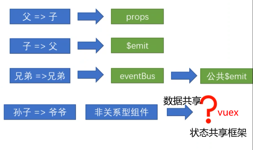
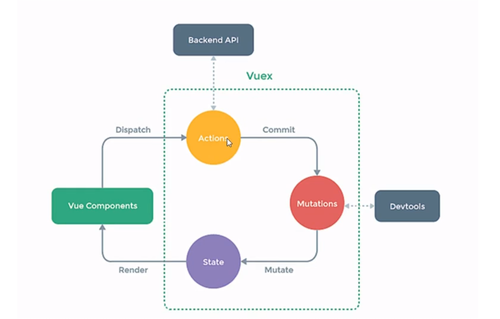
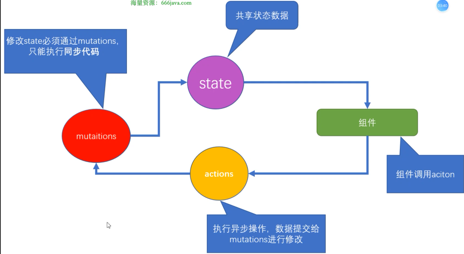

# vuex基础



vuex采用集中式管理组件依赖的共享数据，解决不同组件数据共享的问题。

* vuex工作原理

store：actions,mutations,state的父亲，三者间状态转换由store提供

* 核心模块
state：存放所有共享状态的属性
mutations：对state数据进行修改，只能执行同步代码
actions：执行异步操作，数据提交给mutation进行修改，ajax、定时器...
组件：状态在组件中引用，调用action


## 初始化

npm i vuex --save    //--save运行时依赖，上线后仍使用的依赖
vue2项目--vuex@3
vue3项目--vuex@4

```js
// main.js中
import Vue from 'vue'
import Vuex from 'vuex'
Vue.use(Vuex)      //全局注册vuex功能，vue.use实际上是调用了vuex中的install方法
const store = new Vuex.Store()   //实例化vuex
new Vue({
    el: '#app',
    store
})
目录结构中，创建store文件夹，文件index.js
```

## state

```js
const store = new Vuex.Store({
    // 实例化vuex的构造参数 state mutations actions
    state:{
        // 存储的状态
        count: 0,
    }
})
```

* 在组件中获取count：

```js
原始形式-插值表达式  {{$store.state.count}}
// 使用this.$store获取vuex中store对象实例，通过state属性获取count
计算属性-将state属性定义在计算属性中 {{count}}
computed:{
    count(){
        return this.$store.state.count
    }
}
辅助函数-mapState   把store中的数据映射到组件计算属性中
import {mapState} from 'vuex'
computed:{
    ...mapstate(['count'])
}
```

## mutations

修改state数据，且必须是同步更新，目的是形成数据快照（一次mutations的执行，立刻得到一种视图状态，所以必须是同步）

```js
const store = new Vuex.Store({
    state:{
        count: 0,
    },
    mutations:{  //存放修改state的方法
    // 每个mutation方法 第一个参数是当前vuex中的state属性
    // payload 载荷  调用mutations时，可以传递参数
        addCount(state,payload){
            state.count += payload
        }
    }
})
```

* 在组件中调用mutations
原始形式-$store
`<button @click="addCount"> 点击+10 </button>`

```js
methods:{
    addCount(){
        // 调用mutation方法 提交mutation
        // 参数二就是要传递的载荷payload 传入的参数
        this.$store.commit('addCount',10)
    }
}
```

辅助函数-mapMutations
<!-- 100就是传递的载荷 vue方法中默认第一个参数 事件参数对象 $event -->
`<button @click="addCount(100)"> 点击+100 </button>`

```js
import {mapMutations} from 'vuex'
methods:{
    ...mapMutations(['addCount'])   //此时组件方法中就会有一个对应的addCount方法
}
```

## actions

```js
actions:{
    // 异步操作，从后端获取一个数 更新到state的count中
    // action方法参数一：执行的上下文对象  context相当于组件中的this.$store
    getAsyncCount(context，params){
        // 模拟异步请求
        setTimeout(function(){
            context.commit('addCount',params)  //通过mutation改count值
        },1000)
    }
}
// 原始调用-$store
`<button @click="test1"> 异步调用 </button>`
methods:{
    test1(){
        this.$store.dispatch('getAsyncCount',111)
    }
}
// 辅助函数-mapActions
`<button @click="getAsyncCount(111)"> 异步调用 </button>`

import {mapActions} from 'vuex'
methods:{
    ...mapActions(['getAsyncCount'])   //此时组件方法中就会有一个对应的addCount方法
}
```

## getters

从state中派生出一些状态，这些状态依赖state->用到getters -> 类似于vue中的计算属性

```js
state:{
    count: 0,
    list: [1,2,3,4,5,6,7,8,9,10]  
}
//组件中需要所有大于5的数据
getters:{
    // 函数第一个参数是state  必须有返回值
    // filterList:function(state){
    //     return state.list.filter(item => item>5)
    // }       es5写法
    filterList: state => state.list.filter(item => item > 5)
}
使用getters
// 原始方式-$store    
{{$store.getters.filterList}}
// 辅助函数-mapGetters  
{{filterList}}
import {mapGetters} from 'vuex'
computed:{
    ...mapGetters(['fiterList'])
}
```

## 模块化

所有的数据、更新、操作都在一起，项目越大，越难维护 -> 模块化

* 应用
定义两个模块user和setting，user管理用户的状态token，setting管理应用的名称name

```js
const store = new Vuex.store({
    modules:{
        user:{
            state:{
                token:'12345'
            }
        },
        setting:{
            state:{
                name:'lyq'
            }
        }
    }
})
// 组件
// $store.state.模块名.属性名
{{$store.state.user.token}}
{{$store.state.setting.name}}
// getters 根级别
{{token}}
{{name}}
getters:{
    token: state => state.user.token
    name: state => state.setting.name
}
import {mapGetters} from 'vuex'
computed:{    // mapGetters引用
    ...mapGetters(['token','name'])
}
```

* 模块化中的命名空间 namespaced
默认，模块内action、mutation、getter注册在全局命名空间--多个模块能够对同一个mutation或action做出响应。//user和setting模块都可以通过全局调用action、mutation、getter

```js
user:{
    namespaced: true,    //保证内部模块的高封闭性，true 给自己模块加锁
    state:{
        token:'12345'
    },
    mutations:{
        updateToken(state){
            state.token = 67890
        }
    }
}
`<button @click="updateToken">修改token</button>`
methods:{
    ...mapMutations(['updateToken'])
}
使用带命名空间的模块：
//直接调用
test(){
    this.$store.dispatch('user/updateToken')
}
//辅助函数
`<button @click="test">修改token</button>`
methods:{
    ...mapMutations(['user/updateToken']),
    test(){
        this['user/updateToken']()
    }
}
// createNamespaceHelpers创建基于命名空间的辅助函数
`<button @click="updateToken">修改token</button>`
import {mapGetters, createNamespaceHelpers} from 'vuex'
const {mapMutations} = createNamespaceHelpers('user')
methods:{
    ...mapMutations(['updateToken'])
}
```
