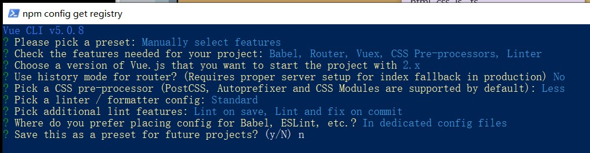

# vue创建项目

前置条件：安装vue脚手架 3.x版本，npm i -g @vue/cli
         运行 vue -V  /  vue --version

* 步骤
打开项目目录，vue create 项目名

please pick a preset ==>选择创建vue2或vue3的项目或手动配置，选手动
check the features needed       ==>选babel,router,vuex,css pre-processors,linter都空格键选上
choose a version                ==>  3.x
use history mode（url中是否有#） ==> n
pick a css pre-processor        ==> less
pick a linter                   ==> eslint + standard config
pick additional                 ==>  lint on save
where do you                    ==> in dedicated config files
save this as a preset           ==> n

运行：
npm run serve
