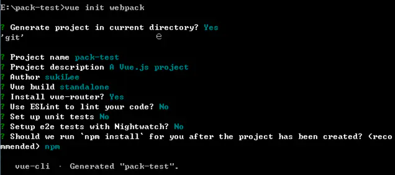

# vue创建项目

npm i -g @vue/cli-init
vue init webpack 项目名

project name
project decription
author
Vue build ==> standalone 回车
Install vue-router ==> Y 回车
Use ESLint to lint your code ==> No
Set up unit tests ==> No
Setup e2e tests with Nightwatch ==> No
Should we run "npm install" ... ==>是否创建后初始化项目，npm

生成文件目录后，cnpm i安装依赖
npm run dev

* 目录结构及作用
├── build/                      # webpack 编译任务配置文件: 开发环境与生产环境
│   └── ...
├── config/
│   ├── index.js                # 项目核心配置
│   └── ...
├ ── node_module/               #项目中安装的依赖模块
   ── src/
│   ├── main.js                 # 程序入口文件
│   ├── App.vue                 # 程序入口vue组件
│   ├── components/             # 组件
│   │   └── ...
│   └── assets/                 # 资源文件夹，一般放一些静态资源文件
│       └── ...
├── static/                     # 纯静态资源 (直接拷贝到dist/static/里面)
├── test/
│   └── unit/                   # 单元测试
│   │   ├── specs/              # 测试规范
│   │   ├── index.js            # 测试入口文件
│   │   └── karma.conf.js       # 测试运行配置文件
│   └── e2e/                    # 端到端测试
│   │   ├── specs/              # 测试规范
│   │   ├── custom-assertions/  # 端到端测试自定义断言
│   │   ├── runner.js           # 运行测试的脚本
│   │   └── nightwatch.conf.js  # 运行测试的配置文件
├── .babelrc                    # babel 配置文件
├── .editorconfig               # 编辑配置文件
├── .gitignore                  # 用来过滤一些版本控制的文件，比如node_modules文件夹
├── index.html                  # index.html 入口模板文件
└── package.json                # 项目文件，记载着一些命令和依赖还有简要的项目描述信息
└── README.md                   #介绍自己这个项目的，可参照github上star多的项目。
build/
