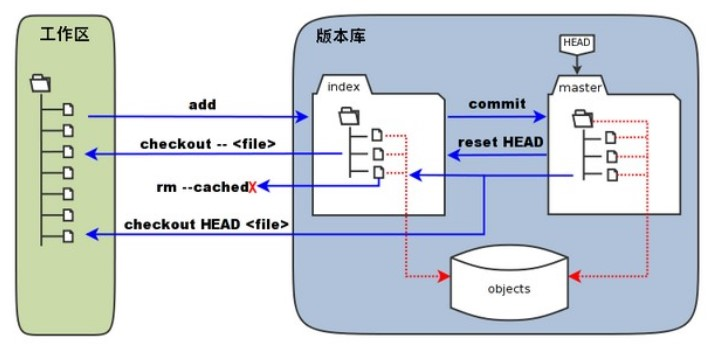
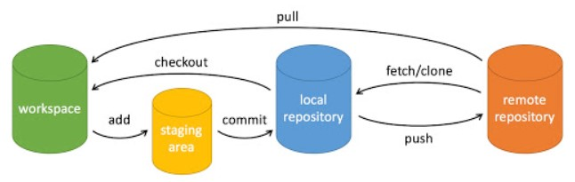
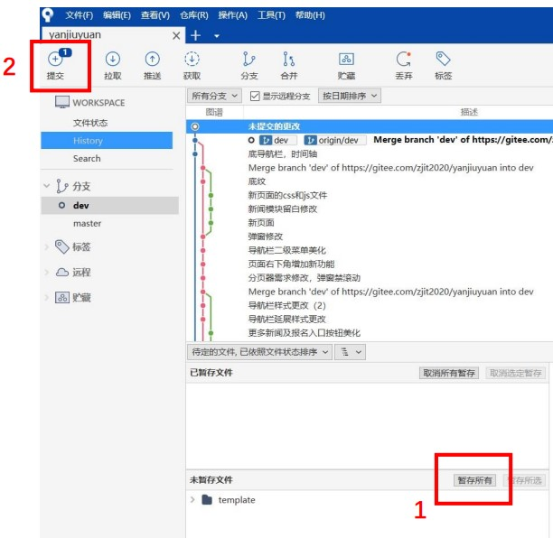
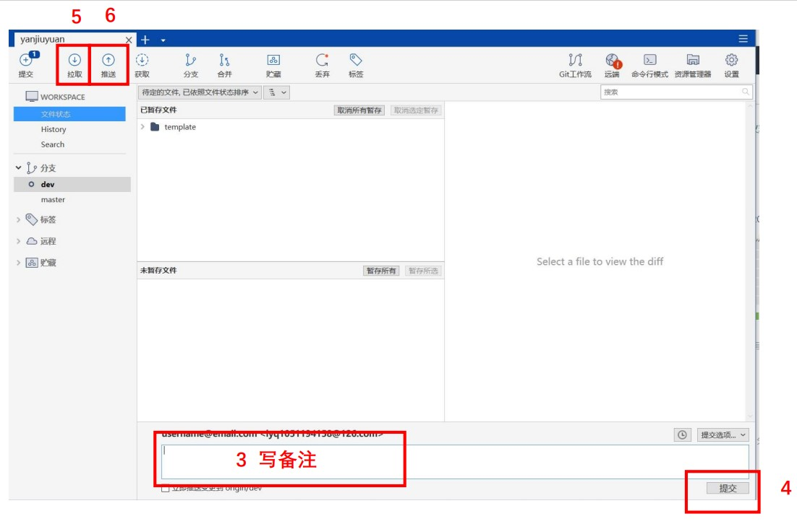
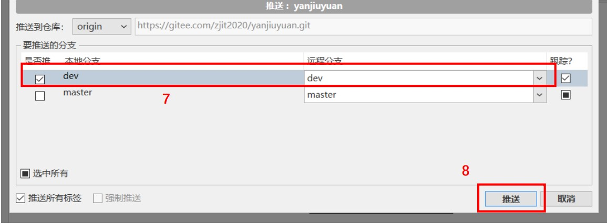

# Git

* 版本控制系统VCS（软件开发中对各种代码文档文件变更的管理，随着时间推进记录文件变化，方便随时回退版本）
1.本地版本控制系统：简单数据库记录文件历次更新差异，RCS原理-在硬盘保存补丁集（修订前后变化），计算各版本文件内容
2.集中式版本控制系统：为了解决多人协作问题，CVS，SVN，有一个单一集中管理中央服务器，保存文件修订版本，管理员给人权限并管理，开发人员从服务器拉取代码，本地开发完再提交到服务器。本地没有全套代码和版本信息，提交更新都要联网，风险大，若无备份服务器磁盘损坏会丢失所有数据
3.分布式版本控制系统：保存的是文件的快照（把文件整体复制保存），去中心化，拉取的是完整的版本库

Git是linus开发的，分布式版本控制系统


## 工作区 暂存区 版本库

工作区（Working Directory）：本地电脑里可见的目录
暂存区（Stage/index）：存放在 .git 隐藏目录下的index文件
版本库（Repository/HEAD）：工作区的隐藏目录 .git  //不算工作区，保存元数据和对象数据库



文件的状态：未跟踪的（untracked）、已修改(modified)、已暂存(staged)、已提交(commit)

## 基本操作

workspace：工作区
stage /index：暂存区
repository：本地仓库
remote：远程仓库



在使用git clone的时候，git会自动地将这个远程的repo命名为origin，拉取它所有的数据之后，创建一个指向它master的指针，命名为origin/master。
之后会在本地创建一个指向同样位置的指针，命名为master，和远程的master作为区分。

初始化仓库时，默认创建master分支，分支指针HEAD，始终指向当前分支。

## 将本地仓库推到线上

如果没有本地仓库。

```shell
# 创建本地仓库
git init
# 将文件添加到暂存区
git add 文件
# 提交历史记录
git commit "提交日志"
# 添加远端仓库地址
git remote add origin 你的远程仓库地址
# 推送提交
git push -u origin master
```

如果已有本地仓库（Vue CLI 已经帮我们初始化好了）

```shell
# 添加远端仓库地址
git remote add origin 你的远程仓库地址
# 推送提交
git push -u origin master
```

如果之后项目代码有了变动需要提交：

```shell
git add
git commit
git push
```

## 常用命令

----新建代码库----
git init          //初始化仓库
git clone [url]   //拷贝远程仓库（下载一个项目）
----配置----
git config --list  //查看当前git配置

----增删文件----
git add 文件名    //添加文件到暂存区
git add .         //添加目录下所有文件到暂存区
git rm 文件名     //删除文件，并将这次删除放入暂存区（从暂存区和工作区删除）
git mv 旧名 新名  //改名工作区文件

----代码提交----
git commit -m '提交信息'  //提交暂存区到本地仓库

----分支----

git branch           //列出本地分支
git branch -r        //列出远程分支
git branch -a        //列出本地和远程分支

git branch 分支名    //新建分支，不切换
git checkout -b 分支名 //新建分支，并切换到该分支

git checkout 分支名    //切换到指定分支，并更新工作区
git checkout -        //切换到上一个分支

git merge  分支名      //合并指定分支到当前分支（必须在master分支上才能合并develop分支）
git branch -d 分支名   //删除分支
git push origin --delete 分支名    //删除远程分支，或git branch -dr [remote/branch]

----暂时保存更改----
git stash        //存储临时改动
git stash pop    //恢复改动

----标签----
git tag                //列出所有标签
git tag 标签名         //在当前commit新建标签
git tag -a 标签名       //给最新一次提交打标签
git tag -a v1.0 -m "信息"    //指定标签信息
git tag -d 标签名       //删除本地标签
git show 标签名         //查看标签信息

----查看信息----
git status        //查看仓库当前状态（显示有变更的文件）
git log           //显示当前分支的版本历史
git diff  文件名  //显示暂存区和工作区的差异
git blame 文件名   //以列表查看该文件历史修改记录

----远程同步----
git fetch [remote]     //下载远程仓库所有变动
git remote  -v         //查看远程仓库
git remote add [name] [url]  //添加远程仓库
git remote rm [name]       //删除远程仓库
git pull [remoteName] [localBranchName]  //拉取远程仓库，合并到当前分支
git push [remoteName] [localBranchName]  //将分支推送到远程仓库
git push -u origin master  //-u 初次推送，记住本次推送分支，下次直接git push

----撤销----
git checkout 文件名    //恢复暂存区的某文件到工作区
git checkout .         //恢复暂存区所有文件到工作区
git reset 文件名        //重置暂存区某文件，与上次commit一致，工作区不变
git reset --hard       //重置暂存区某文件，与上次commit一致（版本回退）

## 分支

长期分支：master、develop。
    master：专门用于部署及负责线上代码回滚，最稳定的分支
    develop：专门存放经过严格测试后，保证代码无bug的分支。开发时主要依赖于该分支开发，新建分支
临时开发分支：
    功能     --feature
    预发布   --release
    修补bug  --hotfix

checkout 切换
merge 合并（拉代码或者push代码都可使用）
rebase 合并（拉公共分支最新代码的时候使用）
push 本地分支->远程主机

## 图形界面工具GUI（Sourcetree）

Sourcetree：Git 客户端管理工具
推送步骤：



